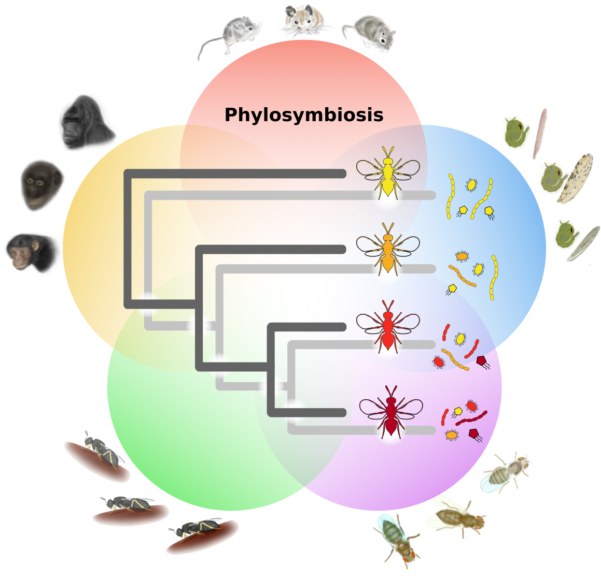

***

## --- Phylosymbiosis ---



#### The observation that evolutionary relatedness between host species parallels the ecological relatedness of their microbiota communities.

[Phylosymbiosis: Relationships and Functional Effects of Microbial Communities across Host Evolutionary History](https://doi.org/10.1371/journal.pbio.2000225)
Andrew W. Brooks, Kevin D. Kohl, Robert M. Brucker, Edward J. van Opstal, Seth R. Bordenstein.
November 18, 2016. *PLOS Biology*. [https://doi.org/10.1371/journal.pbio.2000225](https://doi.org/10.1371/journal.pbio.2000225).


| Host Clade | Common Name | Species | Age of Divergence |
| :------ | :--- | :---: | :---: |
| ‎Culicidae | Mosquitoes | 8 | 108 mya |
| *Drosophila* | Fruit Flies | 6 | 63 mya |
| *Peromyscus* | Deer Mice | 6 | 12 mya |
| Hominid | Primates | 6 | 9 mya |
| *Nasonia* | Jewel Wasps| 4 | 1 mya |

## Gut Microbiota Diversity across Ethnicities in the United States


Here's a useless table:

| Number | Next number | Previous number |
| :------ |:--- | :--- |
| Five | Six | Four |
| Ten | Eleven | Nine |
| Seven | Eight | Six |
| Two | Three | One |


How about a yummy crepe?


Here's a code chunk:

~~~
var foo = function(x) {
  return(x + 5);
}
foo(3)
~~~

And here is the same code with syntax highlighting:

```javascript
var foo = function(x) {
  return(x + 5);
}
foo(3)
```

And here is the same code yet again but with line numbers:


var foo = function(x) {
  return(x + 5);
}
foo(3)


## Boxes
You can add notification, warning and error boxes like this:

### Notification

{: .box-note}
**Note:** This is a notification box.

### Warning

{: .box-warning}
**Warning:** This is a warning box.

### Error

{: .box-error}
**Error:** This is an error box.
